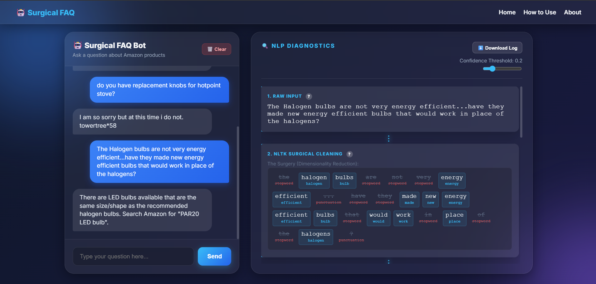
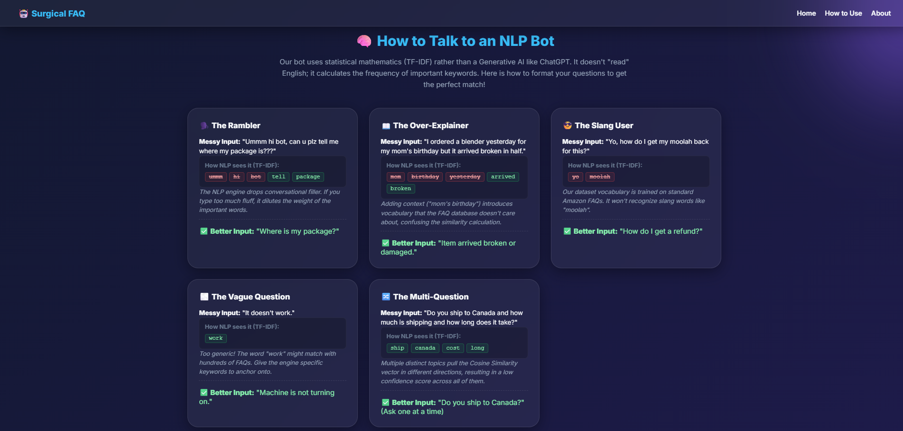

# 🤖 Surgical FAQ Engine: The NLP X-Ray Machine

An interactive, full-stack educational chatbot that doesn't just answer questions—it shows you *exactly* how it thinks. 

Unlike modern "black-box" Generative AI (like ChatGPT), this project demonstrates traditional **Statistical Natural Language Processing**. It exposes the entire mathematical pipeline step-by-step using a sleek Glassmorphism UI, allowing users to watch their sentences get dismantled, mathematically weighted, and geometrically compared in real-time.

## 📸 Preview


---



---

## ✨ Features

### 🔍 Real-Time NLP Diagnostic Pipeline
Watch your input query travel through 5 distinct mathematical stages:
1. **Raw Input**: Captures the exact string.
2. **NLTK Surgical Cleaning**: Visually dissects your sentence. Stop-words and punctuation are struck out and discarded, while root words are highlighted and lemmatized to demonstrate *Dimensionality Reduction*.
3. **TF-IDF Vector Space**: Transforms text into numbers. Displays a dynamic heatmap where the background opacity correlates directly to a word's mathematical "weight" (importance) in the dataset.
4. **Cosine Similarity Engine**: A custom animated SVG graph that geometrically plots the "Best Match FAQ" against your "User Query", visually closing the angle ($\theta$) to calculate the similarity score. Also displays shared trigger words and the Top 5 closest dataset matches.
5. **Decision Logic**: Uses an adjustable confidence slider. If the score falls below the threshold, it triggers a granular **Failure Diagnostic** explaining exactly why the NLP engine failed (e.g., "Out of vocabulary" vs "Low overlap").

### 🎓 Educational "How to Use" Section
A built-in tutorial grid that teaches users how to optimize their queries for statistical NLP engines by showcasing 5 distinct personas (The Rambler, The Over-Explainer, The Vague Question, etc.) and demonstrating how "human fluff" confuses the vector space.

### 💾 Session Persistence & Logging
- **LocalStorage**: Chat history persists across browser refreshes instantly.
- **Download Logs**: Click "⬇️ Download Log" to export a JSON array of your entire session's metadata, including raw inputs, cleaned text, confidence scores, and success rates.

## 🛠️ Tech Stack

**Backend (The Brains):**
- Python 3
- Flask (API Routing)
- NLTK (Tokenization, Stop-words, Lemmatization)
- Scikit-Learn (TF-IDF Vectorization, Cosine Similarity)
- Pandas & NumPy (Dataset handling)

**Frontend (The Beauty):**
- HTML5 / CSS3 (Glassmorphism aesthetics)
- Vanilla JavaScript (Asynchronous API fetching, LocalStorage)
- Custom SVG Math Animations (No heavy charting libraries!)

## 🚀 Getting Started

### Prerequisites
Make sure you have Python 3.8+ installed.

### 1. Clone the repository
```bash
git clone https://github.com/DevBySuraj/CodeAlpha_Chatbot_for_FAQs.git
cd CodeAlpha_Chatbot_for_FAQs
```

### 2. Install Dependencies
It is recommended to use a virtual environment.
```bash
pip install -r requirements.txt
```

*Note: On first run, the NLTK pipeline may need to download corpora (`punkt`, `stopwords`, `wordnet`). The `app.py` script is configured to download these automatically.*

### 3. Provide the Dataset & Models
Ensure the following generated files are in your root directory:
- `cleaned_amazon_data.csv` (The FAQ dataset)
- `vectorizer.pkl` (The pickled TF-IDF model)
- `tfidf_matrix.pkl` (The pickled sparse matrix)

### 4. Run the Application
```bash
python app.py
```
Open your browser and navigate to `http://127.0.0.1:5000`.

## 🤝 Contributing
Contributions, issues, and feature requests are welcome! Feel free to check the [issues page](https://github.com/DevBySuraj/CodeAlpha_Chatbot_for_FAQs/issues).

## 📝 License
This project is open-source and available under the [MIT License](LICENSE).
